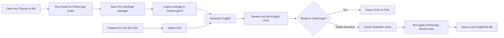

# ChartLingoV2 Team User Guide

ChartLingoV2 creates an editable English version of a Chinese Illustrator chart while preserving the original artwork, chart geometry, data values, logo, and text positions as closely as possible.

> ChartLingoV2 is currently a testing prototype. Always keep the original Illustrator file and review the English output before publication.

## What you need

- Adobe Illustrator 2024, 2025, or 2026.
- The original `.ai` chart with live, editable text. Outlined text cannot be translated automatically.
- The ChartLingo Illustrator exporter: [`export-to-chartlingo.jsx`](illustrator/export-to-chartlingo.jsx).
- A UTF-8 CSV containing `CH` and `EN` columns.
- Roboto installed when returning editable text to Illustrator.
- The ChartLingoV2 web page: [https://yuchej.github.io/ChartLingo/chartlingoV2/](https://yuchej.github.io/ChartLingo/chartlingoV2/).

## Workflow



## 1. Install or run the Illustrator exporter

There are two ways to run the exporter.

### Option A: Run it without installing

1. Open the Chinese `.ai` file in Illustrator.
2. Choose **File → Scripts → Other Script…**.
3. Select [`chartlingoV2/illustrator/export-to-chartlingo.jsx`](illustrator/export-to-chartlingo.jsx).

This is the easiest method for first-time testing.

### Option B: Add it permanently to Illustrator

Copy `export-to-chartlingo.jsx` into Illustrator's `Scripts` folder. The exact version and language folder may differ.

**macOS example**

```text
/Applications/Adobe Illustrator 2026/Presets.localized/en_US/Scripts/
```

**Windows example**

```text
C:\Program Files\Adobe\Adobe Illustrator 2026\Presets\en_US\Scripts\
```

If Illustrator uses another language, replace `en_US` with that language folder. Administrator permission may be required. Restart Illustrator after copying the script. It should then appear under **File → Scripts → export-to-chartlingo**.

The optional Illustrator return script, [`apply-chartlingo-result.jsx`](illustrator/apply-chartlingo-result.jsx), can be installed in the same folder.

## 2. Prepare the Illustrator file

Before exporting:

1. Save and keep a backup of the original `.ai` file.
2. Keep text as live Illustrator text. Do not convert it to outlines.
3. Check that the correct artboard contains the chart.
4. Keep logically separate values as separate text objects when possible.
5. If one Illustrator text frame contains multiple table rows or axis fields, the exporter will attempt to split supported structures into independent ChartLingo items.
6. Close unnecessary documents to reduce confusion.

## 3. Export the Illustrator package

1. Open the source `.ai` file.
2. Run `export-to-chartlingo.jsx`.
3. Choose the artboard export mode. For initial testing, export only the selected artboard.
4. Wait for the progress dialog to finish. Do not edit the Illustrator document during export.
5. Save the generated `.chartlingo` package.

The script creates a structured package containing the source preview, artwork without live Chinese text, artboard dimensions, text records, styles, positions, and graphic metadata. It does not intentionally modify the original file.

## 4. Prepare the translation CSV

The simplest supported CSV has two columns:

```csv
CH,EN
部分领域采用AI的概率（%）,Probability of AI Adoption in Selected Sectors (%)
电子制造业,Electronics Manufacturing
资讯与通信,Information & Communications
```

Requirements:

- The headers must be `CH` and `EN`.
- Save the file as UTF-8 CSV.
- Keep each logical field in its own row.
- Numbers that do not need translation may be omitted; ChartLingo keeps unmatched source values.
- An `ID` column is optional and useful for deterministic matching when IDs are known.

Do not combine separate fields such as a year and quarter, or Source and Credit, into one CSV row unless they are intentionally one logical text item.

## 5. Generate the English chart

1. Open [ChartLingoV2](https://yuchej.github.io/ChartLingo/chartlingoV2/).
2. Select **Import Illustrator Package** and choose the `.chartlingo` file.
3. Select **Import CH/EN CSV** and choose the translation CSV.
4. Select **Generate English**.
5. Compare the Chinese and English previews.

The preview is scaled for the browser; exported files retain the real output dimensions.

## 6. Edit and review

Select **Edit graphic**, then click an English text element.

Available editing actions include:

- Edit text, font family, size, weight, color, line height, and letter spacing.
- Change text alignment and vertical alignment.
- Change line-break mode or text-box width.
- Drag text to move it.
- Drag the blue side handles to change text-box width.
- Drag corner handles to resize the text box.
- Use the rotation handle to rotate text.
- Add an outline around the actual letter shapes.
- Shift-click several elements to select and move them together.
- Align multiple selected elements to their top, vertical center, or bottom.
- Use arrow keys to move selected elements by 1px; use Shift + Arrow for 10px.
- Use **Show Chinese reference** when the source chart is needed beside the English editor.
- Use Undo and Redo in the English toolbar.

Review the following before export:

- Headline and subtitles do not overlap chart content.
- Long labels wrap appropriately.
- Numbers remain aligned with their source columns or data points.
- Source and credit text do not overlap the logo.
- Text remains readable and inside the artboard.
- Translations, names, units, dates, and percentages are correct.

## 7. Export the finished chart

Open the **Export** menu and choose one of three formats:

- **Export SVG** — editable vector output with embedded Roboto font data.
- **Export PNG** — raster output for immediate publishing or review.
- **Send to Illustrator** — downloads a `.chartlingo-result` file for editable Illustrator write-back.

If the chart looks correct in ChartLingoV2, SVG or PNG is the fastest route. Illustrator return is optional.

## 8. Return the English result to Illustrator

1. Keep the matching original `.ai` file open in Illustrator.
2. Run [`apply-chartlingo-result.jsx`](illustrator/apply-chartlingo-result.jsx) using **File → Scripts → Other Script…**, or install it in the same Scripts folder described above.
3. Select the `.chartlingo-result` file downloaded from ChartLingoV2.
4. Confirm the document match warning if appropriate.
5. Choose a **new** `.ai` filename when prompted.
6. Review the new `English - ChartLingoV2` layer.

Never save over the only copy of the source file. Check fonts, clipping, transparency, effects, and text overflow before publication.

## Troubleshooting

### The package will not import

- Confirm that the current exporter script was used.
- Re-export the selected artboard.
- Avoid renaming the package extension.

### Chinese text remains behind the English text

- Confirm the Chinese text is live text, not outlines or embedded in an image.
- Check for duplicated or hidden text layers in Illustrator.

### A translation is missing

- Confirm the Chinese CSV value matches the Illustrator text.
- Check that the CSV is UTF-8 and has `CH` and `EN` headers.
- Keep each logical field in a separate row.

### Text wraps badly

- Edit the text-box width.
- Choose Auto, Single line, Manual, or Match source line-break mode.
- Use manual line breaks only when the final editorial break is known.

### Illustrator cannot find Roboto

Install Roboto Regular and Roboto Bold, restart Illustrator, and apply the result again.

### The chart needs extensive redesign

Export **Send to Illustrator**, apply the result to a new file, and complete the complex layout adjustment in Illustrator.

## Test feedback checklist

When reporting a problem, send:

1. Illustrator version and operating system.
2. Number of artboards.
3. The source `.ai` file if it can be shared.
4. The exported `.chartlingo` package.
5. The CSV used.
6. A screenshot showing the incorrect result.
7. A short description of the expected result.
